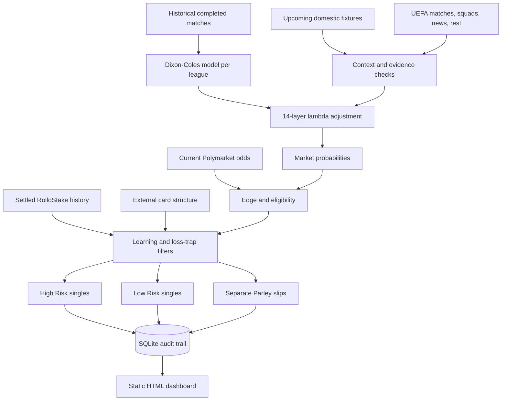

# RolloStake

RolloStake is a research-oriented football prediction and staking system. It
fits Dixon-Coles goal models, adjusts expected goals with current context,
compares model probabilities with market odds, applies learned selection
rules, and publishes an auditable HTML dashboard.

The repository is useful for studying an end-to-end decision system: data
ingestion, probabilistic modelling, market pricing, risk controls, settlement,
performance learning, and static dashboard generation. Predictions are
uncertain and are not guarantees of profit.

## Start here

Read these files in order:

1. [`README.md`](README.md) — orientation, setup, and repository map.
2. [`PROJECT_SPEC.md`](PROJECT_SPEC.md) — intended behaviour, data contracts,
   implemented features, and known gaps.
3. [`models/dixon_coles.py`](models/dixon_coles.py) — the core score model.
4. [`analysis/adjustment_layers.py`](analysis/adjustment_layers.py) — the
   contextual expected-goals pipeline.
5. [`analysis/edge_calculator.py`](analysis/edge_calculator.py) — candidate
   generation, pricing, learned adjustments, and risk-band selection.
6. [`models/core.py`](models/core.py) — SQLite schema and persistence layer.
7. [`dashboard/generator.py`](dashboard/generator.py) — dashboard rendering.
8. [`tests/`](tests/) — executable examples of important behaviour.
9. [`WEEKLY_AGENT_HANDOFF.md`](WEEKLY_AGENT_HANDOFF.md) — the controlled
   production sequence and final-card audit.

Agents working in this repository must also read [`AGENTS.md`](AGENTS.md).

## Safe quick start

The commands below install dependencies, run the test suite, and serve the
existing dashboard. They do not generate or publish new picks.

### Windows PowerShell

```powershell
git clone https://github.com/aungminnkhant94/rollostake.git
cd rollostake
python -m venv .venv
.\.venv\Scripts\Activate.ps1
python -m pip install --upgrade pip
python -m pip install -r requirements.txt
python -m unittest discover -s tests -p "test_*.py"
python -m http.server 8000 --directory dashboard
```

Open <http://127.0.0.1:8000> after starting the server.

### macOS or Linux

```bash
git clone https://github.com/aungminnkhant94/rollostake.git
cd rollostake
python3 -m venv .venv
source .venv/bin/activate
python -m pip install --upgrade pip
python -m pip install -r requirements.txt
python -m unittest discover -s tests -p 'test_*.py'
python -m http.server 8000 --directory dashboard
```

The current suite has been verified with Python 3.14. The direct dependencies
are NumPy, SciPy, Requests, Beautiful Soup, and Playwright.

## How the system works



Production model probabilities pass through these layers in order:

1. rolling-form blend;
2. Elo strength of schedule;
3. finishing quality and xG proxy;
4. motivation;
5. manager bounce;
6. derby context;
7. injuries and suspensions;
8. European fatigue;
9. cup fatigue;
10. rest days;
11. rotation;
12. luck regression;
13. lambda cap; and
14. Dixon-Coles low-score correction.

Each layer records whether evidence was active, available with no signal, not
applicable, or missing. This makes the final probability inspectable instead of
leaving it as an unexplained number.

## Products and markets

| Track | Purpose |
|---|---|
| Low Risk (`D`) | Tighter-price single selections with their own bank and history. |
| High Risk (`C`) | Higher-upside, more volatile singles with separate controls. |
| Parley | Independently selected two-leg and three-leg slips with separate settlement and P&L. |

`STRONG`, `KEEP`, and `CAUTION` are quality labels produced by implemented
edge and learning rules. They are not guarantees, and their historical results
must be evaluated separately.

Supported official market families are:

- `1X2` — home, draw, or away;
- `OU` — match totals;
- `BTTS` — both teams to score;
- `TT` — team totals; and
- `AH` — supported Asian handicap lines, including draw-no-bet shapes.

Quarter-goal Asian handicaps are excluded because half-win and half-loss
accounting is not implemented.

## Prediction, review, publication, and settlement

These are separate operations:

| Operation | Effect |
|---|---|
| `python main.py --skip-scrape --no-fatigue --predictions-only` | Fits models and saves predictions for review. It does not publish an official card. |
| `python scripts\rebuild_card.py --preview output\card-review.json` | Produces a review artifact without changing the database or dashboard. |
| `python scripts\rebuild_card.py --publish-reviewed output\card-review.json` | Publishes the exact reviewed draft only if its inputs and safety checks still match. |
| `python scripts\import_match_results.py match_results.csv` | Imports eligible final scores and settles singles and Parley legs. |

The full weekly pipeline changes live data and must follow
[`WEEKLY_AGENT_HANDOFF.md`](WEEKLY_AGENT_HANDOFF.md). It requires dry runs,
final-status checks for relevant Champions League, Europa League, and
Conference League matches, refreshed squad and news evidence, a card preview,
and a separate publication review.

The dashboard's manual `WIN`, `LOSS`, and `PUSH` controls only change browser
`localStorage`. They are a visual preview and do not settle authoritative data.

## Data model

`data/rollo_stake.db` is the operational source of truth. Important tables
include:

| Table | Role |
|---|---|
| `matches` | Fixtures, kickoff times, scores, statuses, and fatigue context. |
| `odds` | Market selections, decimal prices, implied probability, and collection time. |
| `predictions` | Current model output for each match. |
| `prediction_adjustment_layers` | Before-and-after lambdas and evidence for every layer. |
| `picks` and `results` | Official singles and auditable settlement history. |
| `team_news` | Current injury and suspension evidence. |
| `squad_players` and `squad_depth` | Roster snapshots and positional coverage. |
| `parley_slips` and `parley_legs` | Multi-leg exposure and settlement. |

User-facing kickoff times and played dates are formatted in Macau time
(`Asia/Macau`, UTC+8). Timestamp parsing belongs in
[`utils/match_resolver.py`](utils/match_resolver.py); raw database strings
should not be sliced directly for display.

## Repository map

```text
rollostake/
├── analysis/                  selection, context layers, fatigue, team news
├── config/                    paths and active settings
├── dashboard/                 static dashboard generator and generated HTML
├── data/                      SQLite state and portable profiles
├── friend_cards/              external cards used only for structure lessons
├── models/                    database layer and Dixon-Coles implementations
├── research/                  isolated historical experiments
├── scrapers/                  fixtures, odds, squads, and news collection
├── scripts/                   operational import, report, and publication CLIs
├── tests/                     unit and workflow safety tests
├── utils/                     match history, resolution, aliases, player news
├── AGENTS.md                  agent scope and collaboration rules
├── PROJECT_SPEC.md            intended and implemented system contract
├── WEEKLY_AGENT_HANDOFF.md    canonical production workflow
└── main.py                    model-fitting and prediction entry point
```

## Data sources

- Football-Data.co.uk for historical results and odds inputs;
- ESPN public scoreboards for domestic and UEFA fixtures;
- ESPN rosters for squad and positional-depth snapshots;
- Polymarket for supported current market prices;
- browser or manual JSON evidence for injuries and team news; and
- external prediction cards as a small aggregate structure signal.

External cards never replace RolloStake's model probabilities, implemented
eligibility gates, or settled internal learning.

## Validation

Run the repository tests with:

```powershell
python -m unittest discover -s tests -p "test_*.py"
```

The suite covers BTTS probability, card publication checks, evidence gates,
match history, match resolution, player news, Polymarket discovery, squad
depth, team-news refresh, UEFA context, weekly fixtures, and learning segments.

For production work, the required checks also include Python compilation,
`git diff --check`, SQLite `PRAGMA quick_check`, final-pick evidence reports,
fixture audits, and desktop/mobile dashboard inspection.

## Security and public-repository hygiene

This is a public repository. Never commit API keys, access tokens, passwords,
browser profiles, cookies, private URLs, or account exports.

`config/settings.json` and `data/rollo_stake.db` already exist in repository
history. Git ignore rules do not protect a file after it has been tracked, so
do not place credentials or private information in either file. Use local
environment variables or an ignored local file for any future secret.

Generated run artifacts, Playwright captures, logs, error files, research
caches, and virtual environments are ignored. Review staged files before every
push:

```powershell
git diff --cached --name-only
git diff --cached
```

## Known limitations

- Live injury and team-news coverage depends on browser access or manual JSON
  fallback and still requires evidence review.
- Some team context is heuristic and can be missing or stale.
- Quarter-goal handicap settlement is not supported.
- The model can estimate probability; it cannot remove football variance or
  guarantee profitable results.
- Active thresholds and performance conclusions can change as more picks
  settle. Inspect the code, settings, and database instead of relying on old
  screenshots or fixed counts in documentation.

## License

This repository currently has no `LICENSE` file. Contact the repository owner
before reusing or redistributing the project beyond study and review.
